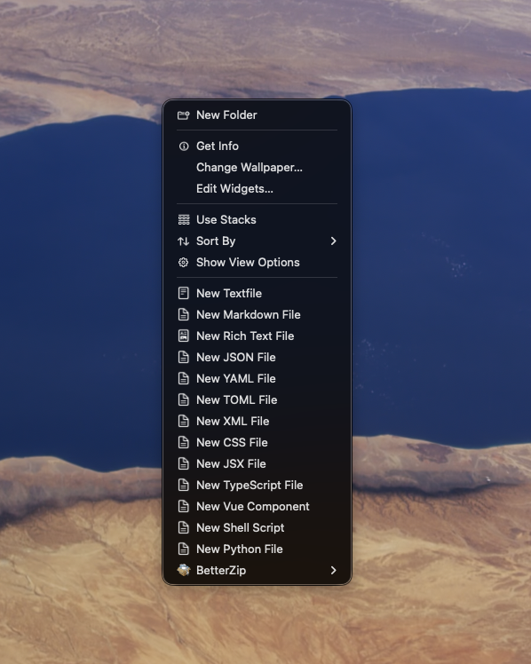
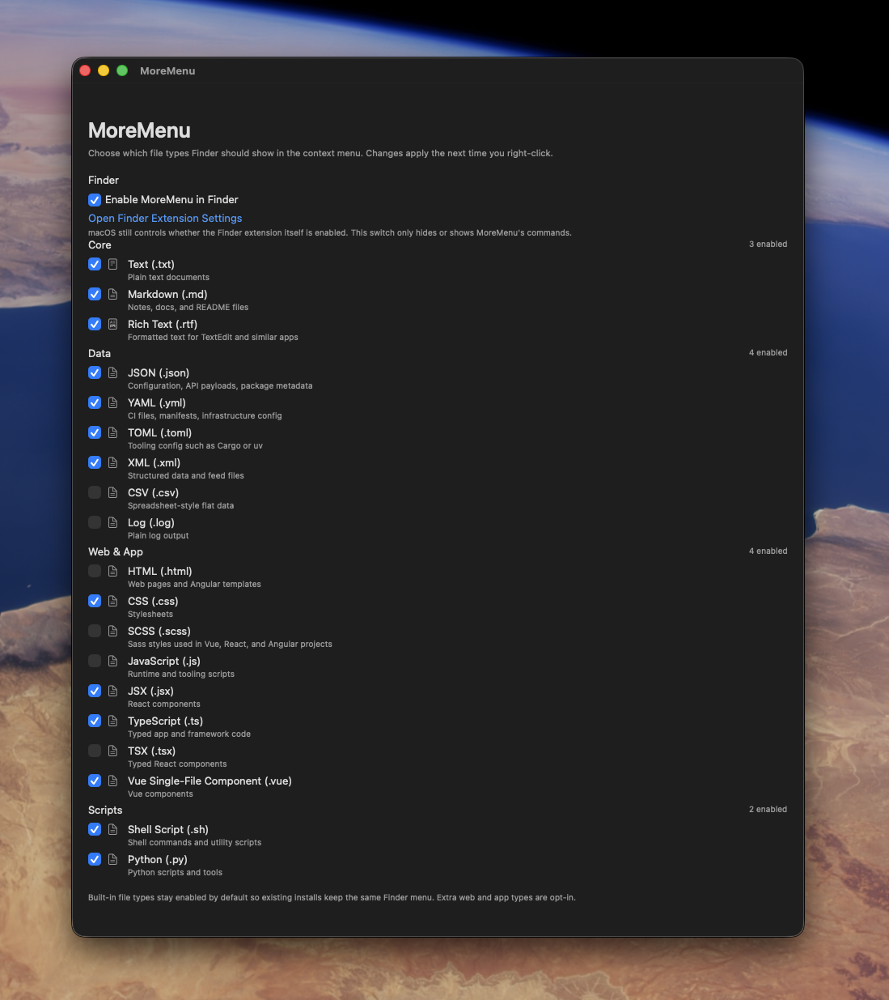

# MoreMenu

MoreMenu adds new-file commands directly to Finder's first-level right-click menu on macOS.

Instead of digging through `Services` or another submenu, you can create a file exactly where you are working and open it immediately in the assigned app. That keeps the workflow short: right-click, choose the file type, start typing.

## What It Does

- adds new-file commands to Finder's top-level context menu
- works on empty space in a Finder window, on the Desktop, and on a selected file or folder
- creates the new file in the current location
- opens the created file right away in the default app for that file type
- auto-increments names: `untitled.ext`, `untitled_0001.ext`, `untitled_0002.ext`, and so on

## Screenshots

### Finder Context Menu

The file types you enable appear directly in Finder's first-level context menu.

### File-Type Settings

The MoreMenu app lets you decide which file types should appear.

## File Types

MoreMenu includes three core types out of the box:

- `Text (.txt)`
- `Markdown (.md)`
- `Rich Text (.rtf)`

You can also enable common developer-oriented file types, including:

- `JSON`, `YAML`, `TOML`, `XML`, `CSV`, `LOG`
- `HTML`, `CSS`, `SCSS`
- `JavaScript`, `JSX`
- `TypeScript`, `TSX`
- `Vue (.vue)`
- `Shell Script (.sh)`
- `Python (.py)`

## How To Manage File Extensions

1. Open `MoreMenu.app`
2. Turn `Enable MoreMenu in Finder` on or off
3. Check the file types you want to see in Finder
4. Right-click in Finder

Changes apply the next time you open the context menu.

Built-in file types stay enabled by default. The larger web and framework-oriented list is opt-in, so the menu does not get crowded unless you want it to.

## How To Use It

Right-click in Finder and choose the file type you want:

- inside a Finder window
- on the Desktop
- on a file or folder

MoreMenu creates the file in that location and immediately opens it in the app currently assigned to that extension.

## Why It Is Useful

macOS normally pushes similar actions into less direct places such as `Services`, or only exposes them when a folder is selected.

MoreMenu keeps those commands at the first menu level and opens the result immediately, which makes repetitive file creation much faster and less interruptive when you are already working in Finder.

## Setup

1. Install `MoreMenu.app`
2. Open `System Settings -> Privacy & Security -> Extensions -> Finder Extensions`
3. Enable `MoreMenu`

After that, right-click in Finder and choose the file type you want.

## Working On External Drives

Folders inside your Home folder (`~/Desktop`, `~/Documents`, projects, and so on) work automatically.

For locations outside your Home folder — external drives, network volumes, or any folder under `/Volumes` — you authorize them once:

1. Open `MoreMenu.app`
2. Click the `Authorized Folders` tab
3. Click `Add Folder...`
4. Pick the parent folder you want MoreMenu to work inside (the whole subtree is covered)

System roots like `/`, `/Users`, or `/Volumes` itself cannot be authorized — pick an actual folder on the drive. Picks inside your Home folder are also skipped since they are already covered.

## Notes

- Finder Sync is an app extension, not a macOS system extension.
- If macOS shows a System Extensions warning, that is not the setting MoreMenu uses.
- The relevant switch is always in `Finder Extensions`.

## Technical Docs

Developer-oriented build, release, architecture, and troubleshooting notes are in [DEVELOPER.md](DEVELOPER.md).
