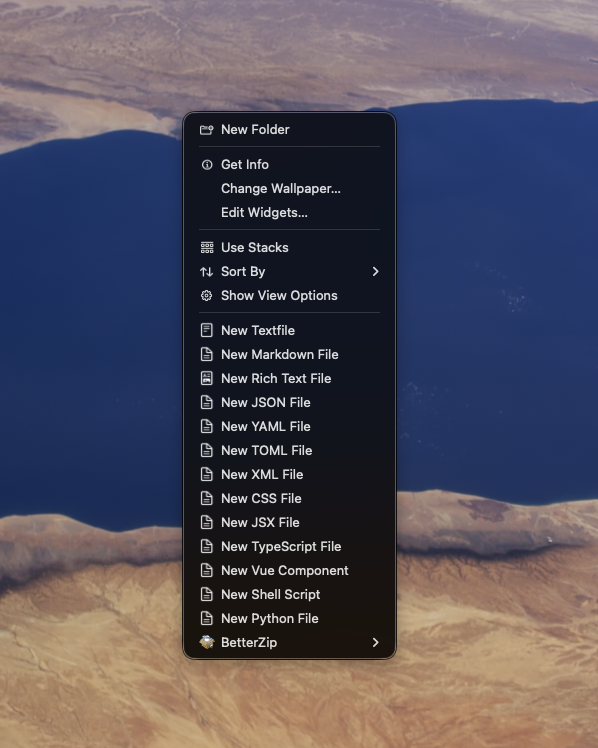
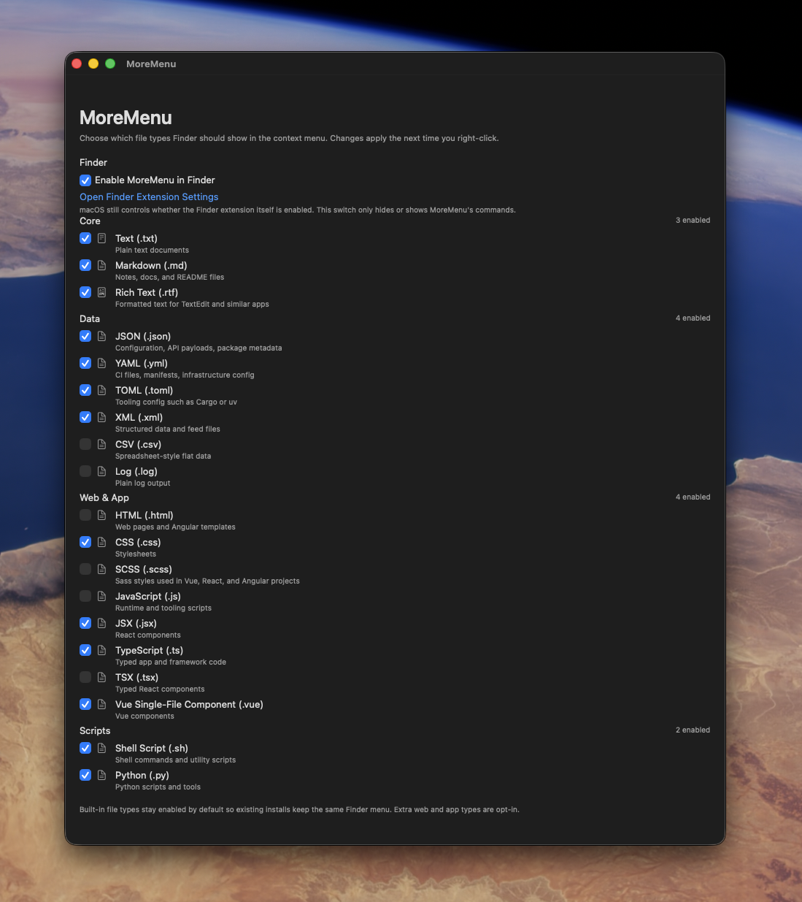

# MoreMenu

MoreMenu adds new-file commands directly to Finder's first-level right-click menu on macOS.

Instead of digging through `Services` or another submenu, you can create a file exactly where you are working and open it immediately in the assigned app. That keeps the workflow short: right-click, choose the file type, start typing.

## What It Does

- adds new-file commands to Finder's top-level context menu
- works on the desktop, on empty space in a Finder window, and on a selected file or folder
- works in every folder of your startup disk and on external and network drives
- creates the new file in the current location
- opens the created file right away in the default app for that file type
- auto-increments names: `untitled.ext`, `untitled_0001.ext`, `untitled_0002.ext`, and so on

## Screenshots

### Finder Context Menu

The file types you enable appear directly in Finder's first-level context menu.

### File-Type Settings

The MoreMenu app lets you decide which file types should appear.

## File Types

MoreMenu includes three core types out of the box:

- `Text (.txt)`
- `Markdown (.md)`
- `Rich Text (.rtf)`

You can also enable common developer-oriented file types, including:

- `JSON`, `YAML`, `TOML`, `XML`, `CSV`, `LOG`
- `HTML`, `CSS`, `SCSS`
- `JavaScript`, `JSX`
- `TypeScript`, `TSX`
- `Vue (.vue)`
- `Shell Script (.sh)`
- `Python (.py)`

## How To Manage File Extensions

1. Open `MoreMenu.app`
2. Turn `Enable MoreMenu in Finder` on or off
3. Check the file types you want to see in Finder
4. Right-click in Finder

Changes apply the next time you open the context menu.

Built-in file types stay enabled by default. The larger web and framework-oriented list is opt-in, so the menu does not get crowded unless you want it to.

## How To Use It

Right-click and choose the file type you want:

- on the empty desktop — no Finder window needed
- inside a Finder window
- on a file or folder

MoreMenu creates the file in that location and immediately opens it in the app currently assigned to that extension.

## Why It Is Useful

macOS normally pushes similar actions into less direct places such as `Services`, or only exposes them when a folder is selected.

MoreMenu keeps those commands at the first menu level and opens the result immediately, which makes repetitive file creation much faster and less interruptive when you are already working in Finder.

## Setup

1. Install `MoreMenu.app`
2. Open MoreMenu and click **Open Finder Extension Settings**
3. Enable the MoreMenu extension in the interface macOS opens
4. Recommended: turn on MoreMenu in **System Settings → Privacy & Security → Full Disk Access**

After that, right-click in Finder and choose the file type you want.

## Where It Works

MoreMenu watches the startup disk and every mounted drive, including external and network drives under `/Volumes`. Drives are added and released automatically when you connect or eject them.

Files can be created wherever your user account may write. In a read-only location, MoreMenu shows an error after you choose a command.

## Privacy Prompts

macOS protects Desktop, Documents, Downloads, iCloud Drive, and removable and network drives. Without Full Disk Access, macOS asks once for each of these location types the first time MoreMenu creates a file there.

With Full Disk Access turned on for MoreMenu, no prompts appear. The switch covers the Finder extension, because macOS attributes the extension's file access to the MoreMenu app.

Your answers stay valid across updates as long as every build is signed with the same developer certificate.

## Local Installation And Updates

Run `./scripts/install-local.sh` from this repository. The installer requires an Apple Development or Developer ID signing identity for the configured developer team. It builds and verifies the app before replacement, preserves existing permission decisions, and imports your previous file-type selections without overwriting settings already saved by the new version.

The app and extension share a certificate-authorized App Group. This removes the cause of the repeated “access data from other apps” prompt.

The installer leaves the old preferences intact. Installing a DMG manually does not run this migration; configure your file types in MoreMenu if needed. Signing and distribution details are in [DEVELOPER.md](DEVELOPER.md).

## Notes

- MoreMenu is an app because macOS accepts Finder extensions only inside an app. The app holds the settings. The extension works in Finder even when the app is closed.
- Finder Sync is an app extension, not a macOS system extension.
- If macOS shows a System Extensions warning, that is not the setting MoreMenu uses.
- The relevant switch is always in `Finder Extensions`.

## Technical Docs

Developer-oriented build, release, architecture, and troubleshooting notes are in [DEVELOPER.md](DEVELOPER.md).
